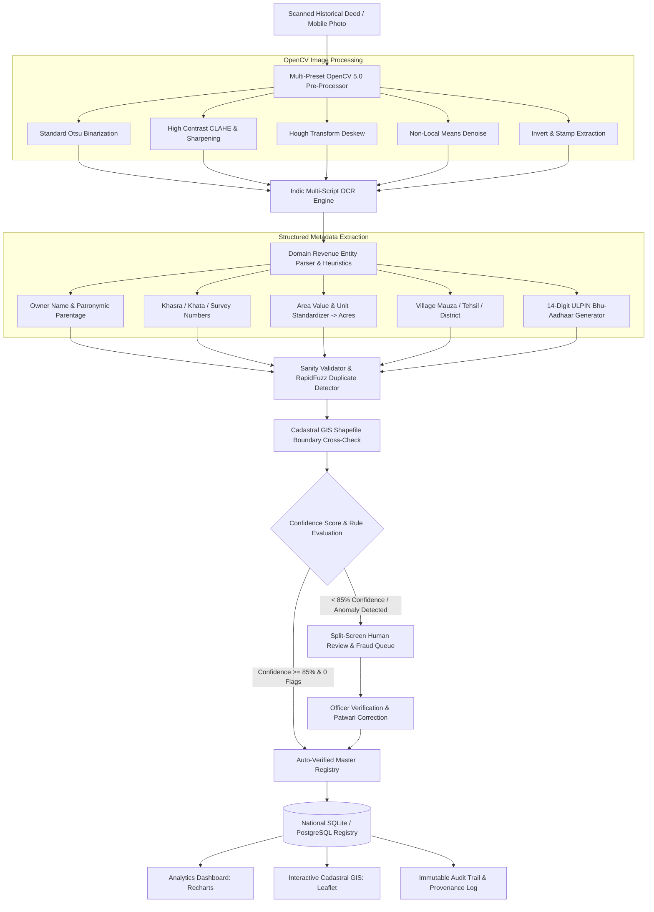

# 🏛️ Landmark-AI
### AI-Powered Land Record Digitization, Validation & Cadastral GIS Platform
**Engineered for the Digital India Land Records Modernization Programme (DILRMP) & Smart India Hackathon**

[](https://www.python.org/)
[](https://fastapi.tiangolo.com/)
[](https://reactjs.org/)
[](https://tailwindcss.com/)
[](https://opencv.org/)
[](https://leafletjs.com/)
[](https://recharts.org/)
[](https://opensource.org/licenses/MIT)
[](https://vercel.com/new/clone?repository-url=https%3A%2F%2Fgithub.com%2FRupam-Hait%2FLandmark-AI&root-directory=frontend)

---

## 📌 Executive Summary & Problem Statement

Under the **Digital India Land Records Modernization Programme (DILRMP)**, India has digitized over 94% of cadastral maps and computerized modern sub-registrar offices. However, land administration faces a critical **"Last 1% Legacy Gap"**:

- **Millions of historical revenue registers** (*Jamabandis*, *Dakhil Kharij* mutation registers, *Saat Bara 7/12* extracts, *Bainama* sale deeds, and *Khasra Girdawaris*) remain trapped in physical record rooms (Malkhanas).
- **Complex historical scripts & regional dialects**: Written in Urdu (*Shikasta*), Modi script, Kaithi, and colloquial Devanagari dialects with aged parchment, ink bleeds, and physical tears.
- **Disputed boundaries & duplicate claims**: Over 66% of civil litigation in Indian courts stems from land boundary discrepancies and fraudulent multi-claim sales of the same Khasra parcel.

**Landmark-AI** solves this challenge by deploying a production-grade, AI-powered digitization, validation, and spatial governance platform that transforms scanned historical revenue deeds into standardized, cryptographically verifiable digital records linked to **14-digit ULPIN (Bhu-Aadhaar)** cadastral plots.

---

## 🏗️ Technical Architecture & Pipeline



---

## 🌟 10 Core Functional Modules

### 1. 🔐 Role-Based Authentication & Evaluator Portal (`LoginView.jsx`)
- **Login screen appears first on startup**: Directs visitors to authenticate under one of 4 governance roles:
  1. **Citizen**: Self-service land registration, status tracking, and public archive search.
  2. **Patwari / Field Officer**: Scanned deed digitization, field measurements, and discrepancy reports.
  3. **Verifier / Revenue Inspector**: Human review queue inspection, correction dispatch, and digital seal approvals.
  4. **District Admin / Tehsildar**: Macro analytics, GIS boundary oversight, and SDM fraud court escalations.
- **Phone + OTP Verification Flow**: Enter phone number with 6-digit OTP verification.
- **1-Click Hackathon Evaluator Logins**: Quick-login buttons with pre-configured personas for instant testing.
- **Session Persistence**: Persona state persists via local storage with a top-navbar capsule and dynamic role switcher.

### 2. 🧭 Always-Visible Top Navigation Bar (`Navbar.jsx`)
- Persistent sticky header across all views with role-filtered navigation links.
- **Live Status Indicators**: Indic OCR Pipeline (*Online*) and Cadastral GIS Engine (*Active*).
- **Real-Time Issue Counter**: Dynamic badge showing pending review and fraud anomaly counts.
- **Profile Dropdown**: Shows officer credentials, district jurisdiction, role switcher, and logout.

### 3. 🏛️ Official DILRMP National Landing Page (`HomeLandingView.jsx`)
- Authoritative government-tech design framing the DILRMP mandate.
- **Live National KPI Metrics**: 1,428,908+ records digitized, 78.0% auto-verified, 28 states & 412 districts onboarded.
- **3-Step Visual Walkthrough**: Scanned Deed Upload &rarr; Indic AI Parsing &rarr; ULPIN Bhu-Aadhaar Issuance.
- Quick-launch CTAs customized by active role.

### 4. ⚡ Upload & Indic OCR Studio (`UploadView.jsx`)
- Drag-and-drop uploader supporting JPEG, PNG, TIFF, and PDF scans.
- **Pre-Loaded Sample Archival Deed Library**:
  - *1974 Handwritten Jamabandi (Jaipur, Rajasthan)* — Aged Devanagari script.
  - *1962 Urdu Dakhil Kharij Mutation Register (Amer)* — Faint Shikasta Urdu + Devanagari.
  - *1985 Typewritten Sale Deed / Bainama (Jodhpur)* — Official revenue stamps and seals.
  - *1998 Khasra Girdawari Crop Register (Bassi)* — Tabular revenue ledger with column shifts.
- **Animated 4-Step OCR Pipeline**: Visual step-by-step progress tracking.
- **Side-by-Side Verification Screen**:
  - Zoom & Pan controls ($70\% - 250\%$).
  - OpenCV filter presets (*Standard, High Contrast CLAHE, Deskew, Denoise, Invert*).
  - Bounding box overlay highlights.
  - Inline field editing with field-level confidence badges.

### 5. 📝 5-Step Digital Land Registration Wizard (`RegisterLandView.jsx`)
- Structured transaction registration wizard:
  1. **Transaction Type**: Sale Deed (Bainama), Succession Mutation (Varisan), Gift/Partition, Lease.
  2. **Parcel Search**: Auto-fills from Khasra #, Khata #, or ULPIN.
  3. **Transferee & Applicant Details**: KYC details, Aadhaar, PAN, and contact information.
  4. **Supporting Deed Cross-Check**: Upload and verify registered deed proofs.
  5. **Review & Collision Check**: Real-time duplicate collision check before submission.
- **Official Sanad Confirmation Slip**: Generates unique ARN tracking ID, 14-digit ULPIN Bhu-Aadhaar, dynamic QR Code, and printable receipt.

### 6. 🔍 Split-Screen Officer Verification Queue (`HumanReviewView.jsx`)
- Queue table with quick filters: *All Queue*, *Low Confidence (<85%)*, and *Flagged Duplicates*.
- **"Assign to Me" Button**: Revenue inspectors can claim queue tickets.
- **Officer Actions**:
  - **Approve & Verify Record**: Formally seals the record with digital signature.
  - **Request Patwari Correction**: Dispatches field re-survey order with custom instructions.
  - **Save Draft**: Saves intermediate corrections.
  - **Reject Document**: Opens rejection modal requiring mandatory administrative rationale.

### 7. 🚨 Duplicate & Fraud Anomaly Detection Center (`FraudDetectionView.jsx`)
- Automated detection algorithms for:
  - *Duplicate Khasra Multi-Claim Suspicion* (RapidFuzz $\ge 80\%$ match on Owner $\times$ Khasra $\times$ Village).
  - *Cadastral GIS Area Boundary Discrepancies* (Deed acreage exceeds cadastral GIS shapefile polygon).
  - *Unauthorized Sub-divisions & Encroachments*.
- **Side-by-Side Conflict Comparison Modal**: Visual contrast between conflicting deeds with similarity percentages.
- **Resolution Actions**: Mark as Genuine, Mark as Duplicate / Revoke, Escalate to SDM Revenue Court.

### 8. 📊 National Analytics & Modernization Dashboard (`DashboardView.jsx`)
- Regional selectors: State and District dropdown filters.
- **Interactive Recharts Visualizations**:
  - **Accuracy & Volume Trajectory**: Dual-axis gradient Area Chart showing month-on-month throughput.
  - **Digitization Status Breakdown**: Donut Chart with live legend.
  - **OCR Extraction Confidence Spectrum**: Bar Chart with confidence tier buckets.
  - **Error Statistics by Type**: Horizontal progress breakdown of top anomalies.
  - **Document Format Distribution**: Proportion of Jamabandis, Mutations, Sale Deeds, and Girdawaris.
- **Report Generator**: One-click CSV export and printable executive PDF summary modal.

### 9. 🗺️ Interactive National Cadastral GIS Map (`DistrictMapView.jsx`)
- Leaflet map with multi-layer switcher: National District Bubbles vs Micro Cadastral Plot Polygons.
- **Text-to-Spatial Popups**: Khasra #, ULPIN Bhu-Aadhaar, Khatedar Owner, Area Extent, Status.
- **Parcel Search & Inspector Drawer**: Search by Khasra or ULPIN with auto-focus camera centering.

### 10. 📜 Immutable Audit Trail & Provenance Log (`AuditTrailView.jsx`)
- Chronological transaction log of every OCR extraction, officer sign-off, and fraud flag resolution.
- Toggle between Timeline and Table views with date/officer/action filters and CSV/JSON export.
- **Dual-Mode Client Adapter (`api.js`)**: Works seamlessly with the live FastAPI backend or in standalone offline mode.

---

## 📋 Standardized Data Schema & ULPIN Specification

All digitized records are standardized into structured schema attributes:

| Field Name | Type | Description | Example |
| :--- | :--- | :--- | :--- |
| `record_identifier` | `String` | Unique internal registry identifier | `BHU-REC-2026-001` |
| `ulpin` | `String` | 14-character Unique Land Parcel Identification Number | `RJ-JAI-SAN-7821-4820` |
| `owner_name` | `String` | Titleholder name (Indic + Romanized) | `रामेश्वर शर्मा (Rameshwar Sharma)` |
| `parentage` | `String` | Father / Husband patronymic | `Jagdish Prasad Sharma` |
| `khasra_number` | `String` | Survey / Plot number | `782/1` |
| `khata_number` | `String` | Revenue account / Khatauni ledger | `142/38` |
| `area_value` | `Float` | Measured area in original unit | `4.85` |
| `area_unit` | `String` | Original unit (Acres, Hectares, Bigha, Sq. Yards) | `Acres` |
| `area_acres` | `Float` | Standardized area in Acres | `4.850` |
| `village` | `String` | Village / Mauza | `Sanganer Dehat` |
| `tehsil` | `String` | Tehsil / Taluka | `Sanganer` |
| `district` | `String` | Revenue District | `Jaipur` |
| `state` | `String` | State jurisdiction | `Rajasthan` |
| `land_classification`| `String` | Land usage category | `Agricultural (Irrigated)` |
| `document_type` | `String` | Legal instrument category | `Jamabandi / RoR` |
| `overall_confidence` | `Float` | Machine extraction confidence score ($0-100\%$) | `94.2%` |
| `status` | `Enum` | `AUTO_VERIFIED`, `HUMAN_VERIFIED`, `PENDING_REVIEW`, `FLAGGED`, `REJECTED` | `AUTO_VERIFIED` |

---

## 🔌 REST API Reference

The FastAPI backend exposes the following RESTful endpoints:

### Records & Verification
- `GET /api/records` — List land records with filtering, searching, sorting, and pagination.
- `GET /api/records/{id}` — Get complete record detail with attached document scans and audit logs.
- `POST /api/records` — Register a new land transaction with sanity checks and deed rendering.
- `POST /api/records/check-duplicate` — Pre-validate draft entry against existing Khasra registry.
- `PUT /api/records/{id}` — Update editable fields and re-evaluate validation rules.
- `PUT /api/records/{id}/verify` — Approve and seal record as verified.
- `PUT /api/records/{id}/reject` — Reject record with administrative reason.
- `GET /api/records/audit-logs` — List immutable audit stream entries.
- `GET /api/records/fraud-flags` — List all active fraud and boundary conflict flags.
- `GET /api/records/export/csv` — Export all land records as CSV.

### OCR & Image Processing
- `GET /api/ocr/samples` — Retrieve pre-loaded historical deed sample library.
- `POST /api/ocr/process-sample` — Process sample deed through OpenCV pipeline.
- `POST /api/ocr/upload` — Upload and process custom scanned document image.
- `GET /api/ocr/preprocess-preview` — Get real-time OpenCV filter preview.

### Dashboard & GIS
- `GET /api/dashboard/stats` — Aggregated KPI metrics, accuracy trajectory, and error statistics.
- `GET /api/districts` — District geo-coordinates, completion rates, and cadastral plots.

---

## 💻 Local Development Setup

### Prerequisites
- **Node.js** 18.0+ and **npm**
- **Python** 3.10+ with `pip`

### 1. Clone the Repository
```bash
git clone https://github.com/Rupam-Hait/Landmark-AI.git
cd Landmark-AI
```

### 2. Frontend Setup (React 19 + Tailwind CSS 4 + Vite)
```bash
cd frontend
npm install
npm run dev
```
The web dashboard will be available at **`http://localhost:5173`**.

### 3. Backend Setup (FastAPI + SQLite + OpenCV)
```bash
cd ../backend

# Create virtual environment (optional)
python -m venv venv
# Windows: venv\Scripts\activate | Linux/macOS: source venv/bin/activate

# Install dependencies
pip install -r requirements.txt

# Start the FastAPI development server
python -m uvicorn app.main:app --host 127.0.0.1 --port 8000 --reload
```
API Documentation (Swagger UI) will be available at **`http://localhost:8000/docs`**.

### 4. Run Automated Integration Tests
```bash
cd backend
python test_api.py
```

---

## ☁️ Cloud Deployment

### Deploy Frontend to Vercel
[](https://vercel.com/new/clone?repository-url=https%3A%2F%2Fgithub.com%2FRupam-Hait%2FLandmark-AI&root-directory=frontend)
1. Import repository `Rupam-Hait/Landmark-AI` on Vercel.
2. Set **Root Directory** to `frontend`.
3. Set **Framework Preset** to `Vite`.
4. Deploy.

### Deploy Backend to Render
1. Create a new **Web Service** on Render connected to `Rupam-Hait/Landmark-AI`.
2. Set **Root Directory** to `backend`.
3. Set **Build Command**: `pip install -r requirements.txt`.
4. Set **Start Command**: `uvicorn app.main:app --host 0.0.0.0 --port $PORT`.
5. Deploy.

---

## 🏆 Hackathon Evaluator & Demo Guide

To demonstrate the complete platform in under 3 minutes:

1. **Authentication Flow**:
   - Open the app. The **Role Selection Login Screen** appears first.
   - Click **"District Admin"** or enter mobile `9876543210` + OTP `849201`.
2. **Landing Page**:
   - View the DILRMP National Mission banner and KPI metric counters.
3. **Upload & OCR Studio**:
   - Navigate to **"Digitize Doc"**.
   - Click on the **1962 Urdu Mutation Register** sample deed.
   - Observe the 4-step animated OCR pipeline and switch OpenCV presets (*High Contrast*, *Deskew*, *Invert*).
4. **Human Review Queue**:
   - Navigate to **"Verification Queue"**.
   - Click **"Assign to Me"**, inspect the side-by-side deed, edit a field, and click **"Approve & Verify Record"**.
5. **Fraud & Conflict Detection**:
   - Navigate to **"Fraud & Flags"**.
   - Open the duplicate conflict on Khasra `782/1` to view the side-by-side comparison modal and resolve the flag.
6. **Cadastral GIS Map**:
   - Navigate to **"GIS Map"**.
   - Switch to **"Cadastral Plots"** layer, search for Khasra `782/1`, and view the text-to-spatial popup.
7. **New Registration Wizard**:
   - Navigate to **"New Record"**, complete the 5-step wizard, and print the official **Sanad Confirmation Slip** with QR code.
8. **Dashboard & Report Export**:
   - Navigate to **"Dashboard"**, filter by District, view Recharts graphs, and click **"Export CSV"** / **"Generate Report"**.

---

## 📁 Repository Structure

```
Landmark-AI/
├── backend/
│   ├── app/
│   │   ├── routes/
│   │   │   ├── records.py       # Records CRUD, verify, reject, audit logs, fraud flags, CSV
│   │   │   ├── ocr.py           # OCR upload, OpenCV presets, sample deed processors
│   │   │   ├── dashboard.py     # Analytics & KPI aggregations
│   │   │   └── districts.py     # Geo-coordinates and district metrics
│   │   ├── database.py          # SQLite database engine & session management
│   │   ├── models.py            # Document, LandRecord, ValidationIssue, AuditLog ORM
│   │   ├── ocr_engine.py        # OpenCV image processing & OCR pipeline
│   │   ├── parser.py            # Heuristic revenue text parser & confidence scoring
│   │   ├── validator.py         # Sanity rules & RapidFuzz duplicate detection
│   │   ├── seed_data.py         # Database seeder (34 realistic records & deeds)
│   │   ├── sample_generator.py  # Archival deed image generator
│   │   └── main.py              # FastAPI main application
│   ├── Dockerfile               # Production container definition
│   ├── requirements.txt         # Python dependencies
│   └── test_api.py              # Automated API & pipeline integration tests
├── frontend/
│   ├── src/
│   │   ├── components/
│   │   │   ├── Navbar.jsx           # Always-visible top navigation bar
│   │   │   ├── Sidebar.jsx          # Collapsible navigation drawer
│   │   │   ├── ConfidenceBadge.jsx  # Confidence percentage indicator
│   │   │   ├── StatusBadge.jsx      # Verification status pill
│   │   │   └── RecordDetailModal.jsx# Full record inspection modal
│   │   ├── views/
│   │   │   ├── LoginView.jsx        # Role selection & OTP evaluator login
│   │   │   ├── HomeLandingView.jsx  # DILRMP National mission landing page
│   │   │   ├── DashboardView.jsx    # Analytics dashboard & Recharts visualizations
│   │   │   ├── UploadView.jsx       # Upload studio with OpenCV filter toggles
│   │   │   ├── RegisterLandView.jsx # 5-step new land registration wizard
│   │   │   ├── HumanReviewView.jsx  # Split-screen officer verification queue
│   │   │   ├── FraudDetectionView.jsx# Duplicate & boundary anomaly detection
│   │   │   ├── RecordsView.jsx      # Land records archive explorer
│   │   │   ├── DistrictMapView.jsx  # Interactive Cadastral GIS Leaflet map
│   │   │   └── AuditTrailView.jsx   # Immutable provenance audit stream
│   │   ├── api.js                   # Dual-mode API adapter & offline mock fallback
│   │   ├── App.jsx                  # Main application container & state routing
│   │   └── index.css                # Tailwind CSS & Leaflet styling
│   ├── vercel.json                  # Vercel SPA routing
│   ├── package.json
│   └── vite.config.js
├── render.yaml                      # Render Blueprint deployment config
└── README.md
```

---

## 📜 License
This project is licensed under the **MIT License**. Engineered for the **Smart India Hackathon** & the **Department of Land Resources (DoLR), Government of India**.


