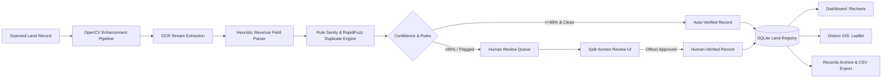

# Landmark AI 🏛️
### AI-Powered Legacy Land Records Digitization & Verification Platform

[](https://www.python.org/)
[](https://fastapi.tiangolo.com/)
[](https://reactjs.org/)
[](https://tailwindcss.com/)
[](https://opencv.org/)
[](https://leafletjs.com/)
[](https://vercel.com/new/clone?repository-url=https%3A%2F%2Fgithub.com%2FRupam-Hait%2FLandmark-AI&root-directory=frontend)

**Landmark AI** is an enterprise-grade, full-stack AI platform built for the **National Land Records Modernization Programme (NLRMP)**. It automates the digitization, OCR parsing, rule-based validation, fuzzy duplicate detection, and human verification of legacy handwritten and scanned land records (Jamabandis/Record of Rights, Mutation Registers, Conveyance Sale Deeds, and Khasra Girdawaris).

---

## 🌟 Key Features

### 1. ⚡ AI-Powered OCR & Multi-Preset OpenCV Image Processing
- **OpenCV Enhancement Pipelines**:
  - `Standard Otsu`: Grayscale + bilateral noise reduction + Otsu binarization.
  - `High Contrast CLAHE`: Contrast Limited Adaptive Histogram Equalization with sharpening kernel for faint ink and faded archival seals.
  - `Deskew & Straighten`: Automated Hough transform / rotational alignment for tilted mobile/scanner captures.
  - `Deep Denoise`: Non-local means filter for aged, textured parchment paper.
  - `Invert Mask`: Inverted binarization for dark stamps and watermark separation.
- **Domain-Specific Field Parser**:
  - Extracts 12+ structured revenue attributes: **Owner Name, Parentage (S/O, W/O, D/O), Survey/Khasra Number, Khatauni/Khata Number, Measured Area & Units (Acres, Hectares, Bigha, Biswa, Sq. Yards), Standardized Acreage, Village (Mauza), Tehsil, District, State, Land Classification, and Document Type**.
  - Computes character-level and field-level confidence scores ($0-100\%$) and overall document certainty rating.

### 2. 🛡️ Rule Validation & RapidFuzz Duplicate Detection
- **Sanity Checks**: Flags impossible area values ($\le 0$ or $> 500$ Acres), missing mandatory titleholders, and syntax anomalies.
- **Fuzzy Duplicate Detection**: Compares incoming extractions against all registered parcels in SQLite using RapidFuzz on $(Owner \times Khasra \times Village \times Tehsil)$. When similarity is $\ge 80\%$, the record is flagged as a conflict with matched record IDs and similarity percentages.

### 3. 🔍 Split-Screen Human Review Workspace
- **Side-by-Side Verification**: Original high-resolution document scan on the left (with zoom, pan, and real-time OpenCV filter toggles) alongside editable extracted fields on the right.
- **Fuzzy Duplicate Conflict Comparison Drawer**: Side-by-side comparison of the conflicting database record and the extracted scan.
- **Officer Actions**: **Approve & Mark Verified**, **Save Draft**, **Reject Document** with administrative reason, and queue navigation.

### 4. 📝 Citizen & Officer Land Registration Portal
- Dedicated self-service portal to manually register new land parcels.
- Live **Cadastral Conflict Pre-Check** against the registry before submission.
- Generates an official digital **Sanad / Registration Acknowledgement Slip** with downloadable/printable receipt.

### 5. 📊 Analytics Dashboard & Recharts Visualizations
- Real-time KPI cards (Total Processed, Auto-Verified Rate, Pending Review Backlog, Flagged Duplicates).
- Recharts visualizations: Status breakdown donut chart, OCR confidence distribution bar chart, document type breakdown, and land classification distribution.
- Complete live audit log tracking all AI and human transactions.

### 6. 🗺️ District Geo-Map (Leaflet GIS)
- Interactive geospatial map tracking revenue divisions across India (Jaipur, Jodhpur, Pune, Varanasi, Lucknow, Indore, Patna, Bhopal, Nagpur, etc.).
- Color-coded circle markers scaled by volume and colored by completion status with interactive inspection popups.

---

## 🏗️ Architecture & Workflow



---

## ☁️ Cloud Deployment Guide (Public Live URLs)

### Deploy Frontend to Vercel
[](https://vercel.com/new/clone?repository-url=https%3A%2F%2Fgithub.com%2FRupam-Hait%2FLandmark-AI&root-directory=frontend)

1. Connect your GitHub account on [Vercel](https://vercel.com).
2. Import repository `Rupam-Hait/Landmark-AI`.
3. Set **Root Directory** to `frontend`.
4. Click **Deploy**.

### Deploy Backend to Render
1. Create a new Web Service on [Render](https://render.com).
2. Connect `Rupam-Hait/Landmark-AI`.
3. Set **Root Directory** to `backend`.
4. Set **Build Command**: `pip install -r requirements.txt`.
5. Set **Start Command**: `uvicorn app.main:app --host 0.0.0.0 --port $PORT`.
6. Click **Deploy**.

---

## 💻 Local Development

### Prerequisites
- Python 3.10+
- Node.js 18+ and npm

### 1. Clone the Repository
```bash
git clone https://github.com/Rupam-Hait/Landmark-AI.git
cd Landmark-AI
```

### 2. Backend Setup
```bash
cd backend

# Install Python dependencies
pip install -r requirements.txt

# Start the FastAPI server (auto-seeds 34 realistic records and sample deeds)
python -m uvicorn app.main:app --host 127.0.0.1 --port 8000 --reload
```
Backend API will be available at **`http://127.0.0.1:8000`** (Swagger docs at `/docs`).

### 3. Frontend Setup
```bash
cd ../frontend

# Install npm dependencies
npm install

# Start the Vite development server
npm run dev
```
Frontend Web App will be available at **`http://127.0.0.1:5173`**.

---

## 🧪 Running Automated Integration Tests

Run the full end-to-end integration test suite:
```bash
cd backend
python test_api.py
```

---

## 📁 Repository Structure

```
Landmark-AI/
├── backend/
│   ├── app/
│   │   ├── routes/
│   │   │   ├── records.py     # Records CRUD, verification, registration, CSV export
│   │   │   ├── ocr.py         # Upload, OpenCV presets, sample deed processors
│   │   │   ├── dashboard.py   # Analytics & KPI aggregations
│   │   │   └── districts.py   # Geo-coordinates and district metrics
│   │   ├── database.py        # SQLite engine & session management
│   │   ├── models.py          # Document, LandRecord, ValidationIssue, AuditLog ORM
│   │   ├── ocr_engine.py      # OpenCV image processing & OCR pipeline
│   │   ├── parser.py          # Heuristic revenue text parser & confidence scoring
│   │   ├── validator.py       # Sanity rules & RapidFuzz duplicate detection
│   │   ├── seed_data.py       # Database seeder (34 realistic records & deeds)
│   │   ├── sample_generator.py# Archival deed image generator
│   │   └── main.py            # FastAPI main application
│   ├── Dockerfile             # Production container definition
│   ├── requirements.txt       # Python dependencies
│   └── test_api.py            # Automated API & pipeline integration tests
├── frontend/
│   ├── src/
│   │   ├── components/
│   │   │   ├── Navbar.jsx
│   │   │   ├── Sidebar.jsx
│   │   │   ├── ConfidenceBadge.jsx
│   │   │   ├── StatusBadge.jsx
│   │   │   └── RecordDetailModal.jsx
│   │   ├── views/
│   │   │   ├── DashboardView.jsx
│   │   │   ├── UploadView.jsx
│   │   │   ├── RegisterLandView.jsx
│   │   │   ├── HumanReviewView.jsx
│   │   │   ├── RecordsView.jsx
│   │   │   └── DistrictMapView.jsx
│   │   ├── api.js             # Centralized API client
│   │   ├── App.jsx            # Main app container & routing
│   │   └── index.css          # Tailwind CSS & Leaflet styling
│   ├── vercel.json            # Vercel SPA routing
│   ├── package.json
│   └── vite.config.js
├── render.yaml                # Render Blueprint deployment config
└── README.md
```

---

## 📜 License
This project is licensed under the MIT License.
